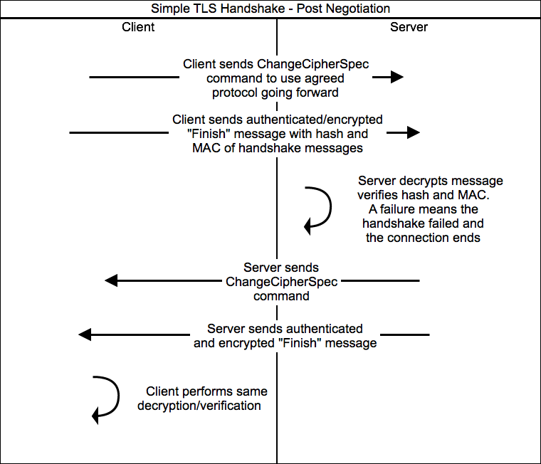
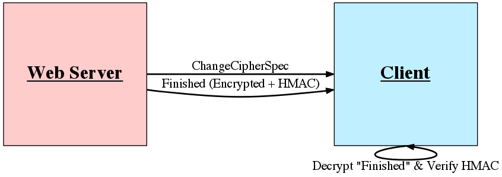
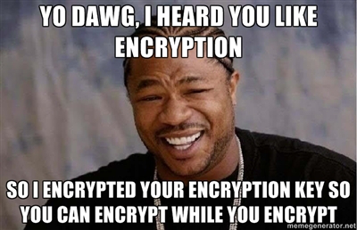
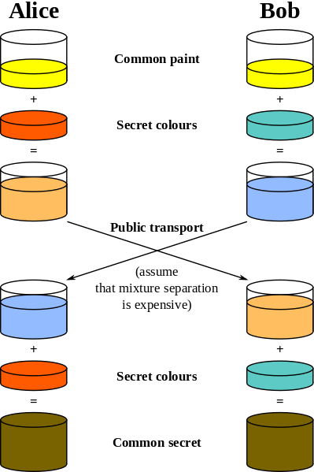
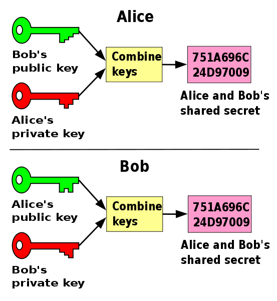

gradient: radial-off-center #ff5c5c #cecece
footer:
subfooter:
title: Certificate Authorities & SSL
author: Matt Glover

Certificate Authorities & SSL
=============================
---

### 
The Good,

### 
The Bad and

### 
The Break-ins

What Will Be Covered
====================
- Acronym Soup
- Certificate Authorities (CAs) and TLS/SSL
- CAs and SSL in the News
- Known Weak Points
- Suggested Solutions

Acronym and Definition Soup
===========================

- TLS - Transport Layer Security
- SSL - Secure Sockets Layer
- PKI - Public Key Infrastructure
- CA - Certificate Authority
- D-H - Diffie-Hellman key exchange
- MitM - Man-in-the-middle attack
- WoT - Web of Trust

TLS/SSL
=======
<% left do %>
### What It Is
- A cryptographic protocol
- Protection for data in transit
- A key exchange protocol
- Eavesdropping and message tampering prevention
<% end %>

<% right do %>
### What It Is **NOT**
- An encryption algorithm
- Protection for data at rest
- Strictly dependent on certificate authorities
- The same as SSH
<% end %>

Where is TLS Used?
==================
- HTTP - HTTPS
- FTP - FTPS (explicit) over standard FTP via "AUTH TLS"
    - This is *not* the same as SFTP
- SMTP - Using STARTTLS
- NNTP - NNTPS to provide Network News Transfer Protocol over TLS
- XMPP - Used to encrypt the communication channel. SASL is used for authentication
- VPN - OpenVPN uses TLS for key exchange
- SIP - Encrypted on port 5061

PKI, CAs, X.509, and Certificates
=================================
- Public Key Infrastructure (PKI) is a means for managing/distributing digital certificates
- Typically CA digitally signs and publishes a public key for a user using its own private key
- CA is a trusted third party so: CA trust => User key trust
- X.509 is a standard for PKI that specifies the standard format for certificates, revocation, and the certificate validation algorithm
- Intermediate versus Trusted Root Certificates

CAs Continued
=============
- Registration Authority (RA) provides multiple levels of
assurance that the user is who they claim
    - Domain Validation - Send an email root@example.com
    - Extended Validation:
        - Verify legal identity and physical presence of owner
        - Exclusive domain control
        - Verify legal authority of requester
- Wildcard Certificate
- CA web browser integration
    - Lets look at some certs!
- CRL and Online Certificate Status Protocol

Fscking TLS, how does it work?
==============================

TLS (ClientHello)
=================

TLS (ServerHello)
=================

TLS (Certificate)
=====================

TLS (Negotiation Wrap-up)
=========================

TLS (Post Negotiation)
=============

TLS (Client Begins Encryption)
=====================

TLS (Server Begins Encryption)
=====================

TLS Handshake in Review
=======================

Demo
====
TLS via Wireshark

(ip.addr == 127.0.0.1) && (ssl)

Public-Key Cryptography
=======================

Public-key cryptography is essentially the use of asymmetric
algorithms which produce a public and private key pair.

RSA for example: User creates and publishes the product of
two large primes (p, q) and an auxiliary value (e), as their public
key. The prime factors must be kept secret. The RSA algorithm
is such that anyone can use the public key result to encrypt a
message but the prime factors are required to decrypt the
message.

RSA - Show (some of) Your Work!
===============================
- Two large primes (`p` and `q`) are generated and stored privately
- The product of the primes, `n`, is the modulus for the public and private keys
- Privately calculate: `φ(n) = (p – 1)(q – 1)`, where `φ` is [Euler's totient function](http://en.wikipedia.org/wiki/Euler%27s_totient_function).
- Determine `e` where: `1 < e < φ(n)` and `gcd(e,φ(n)) = 1`
- Publish `e` as the public key exponent
- Determine `d` where: `d = e–1 mod φ(n)`
- Encrypt data with the public key using: `c = m·e (mod n)`
    - `m` is the padded message as an integer
    - `c` is the encrypted text
- Decrypt the data with the private key using: `m = c·d (mod n)`

D-H Key Exchange
================

D-H Key Exchange (Part II)
==========================

Wrong Certificate Example
=========================
Dave wants to log on to his favorite Twilight(TM) fan site:
[http://www.fairiesvampires.com/main/authorization/signIn](http://www.fairiesvampires.com/main/authorization/signIn)

But he does not want his credentials to be transmitted in the
clear otherwise someone might log in as him and claim he does
not love sensitive caring vampires!

So he changes the URL to https!
[https://www.fairiesvampires.com/main/authorization/signIn](https://www.fairiesvampires.com/main/authorization/signIn)

But things do not go as expected. What should Dave do!?

Brief Detour - HTTPS Best Practices
===================================
Stolen from OWASP: [http://goo.gl/GjkGI](http://goo.gl/GjkGI)

- Use TLS for all login and authenticated pages
- Use TLS to transmit sensitive data
- Do not provide non-TLS pages for secure content
    - HTTP => HTTPS redirects and HSTS
- Do not mix TLS and non-TLS content
- Use the "Secure" cookie flag
- Keep sensitive data out of the URL
- Prevent caching of sensitive data

More Examples
=============
- Mixed content example site: [https://ie.microsoft.com/testdrive/browser/mixedcontent/assets/woodgrove.htm](https://ie.microsoft.com/testdrive/browser/mixedcontent/assets/woodgrove.htm)
- Rails >= 3.1
    - Set `config.force_ssl=true` in your environment configuration
        - Forces all connections to use HTTPS
    - Any cookies marked "Secure" will be transmitted over HTTPS only
    - Autoredirect to HTTPS, "Secure" cookies, and HSTS
- Optionally set up HSTS
    - Only set this for HTTPS connections
    - Nginx example:
<% code do %>
add_header Strict-Transport-Security max-age=31536000;
<% end %>

Bad Press for CAs and TLS 2011-2013
===================================
CA Issues:

- [Comodo affiliate](http://blogs.comodo.com/it-security/data-security/the-recent-ra-compromise/) issues fraudulent certs for domains like `mail.google.com`, `login.yahoo.com`, `addons.mozilla.org`
- [CA DigiNotar](http://googleonlinesecurity.blogspot.com/2011/08/update-on-attempted-man-in-middle.html) compromised subjecting users to MitM via fraudulent certs
- [Adobe code signing certificates](https://blogs.adobe.com/asset/2012/09/inappropriate-use-of-adobe-code-signing-certificate.html) stolen and used to sign malicious software
- [Bit9 code signing certificates](https://blog.bit9.com/2013/02/08/bit9-and-our-customers-security/) were stolen allowing malware to be signed as legitimate software

TLS and Other Issues:

- Chrome 14/15 allowed certain types of redirects to display a valid HTTPS URL with content from a different site
- [B.E.A.S.T.](https://threatpost.com/en_us/blogs/new-attack-breaks-confidentiality-model-ssl-allows-theft-encrypted-cookies-091911) decrypts part of PayPal encrypted data stream using a chosen plain-text attack against TLS 1.0 because it uses a predictable IV in CBC mode
- [CRIME](https://threatpost.com/en_us/blogs/crime-attack-uses-compression-ratio-tls-requests-side-channel-hijack-secure-sessions-091312) uses an information leak in the compression ratio of TLS requests as a side channel to enable decryption of requests from client to server
- [Lucky Thirteen TLS and DTLS MitM](http://www.isg.rhul.ac.uk/tls/) discovered via an advanced padding oracle attack against HMAC-SHA1 MACs

Weaknesses (Real and Perceived)
===============================
- Domain Validation versus Extended Validation
- CA is a central point of failure
- Certificates scoped by convention not protocol
    - Any CA can issue a certificate for any site
- TLS 1.0 amplified difficulties in patching a widespread protocol
- Browser handling is confusing at best and can be abused with tools like sslstrip

Proposed Solutions and Mitigations
==================================
- SSL Observatory: [https://www.eff.org/observatory](https://www.eff.org/observatory)
- Use DNSSEC or HTTPS headers for authenticity check
- Updating CA operational guidelines and standards
- Sovereign Keys: [https://www.eff.org/sovereign-keys](https://www.eff.org/sovereign-keys)
- Google researchers suggest public append log, proofs, and client check: [http://goo.gl/8yKLR](http://goo.gl/8yKLR)
- Convergence: [http://convergence.io/](http://convergence.io/)
- Monkeysphere: [http://web.monkeysphere.info/](http://web.monkeysphere.info/)

Questions?
==========
Name: Matt Glover

Email: matt.glover@mandiant.com

Type: Public PGP Key

Key ID: 54C013B4

